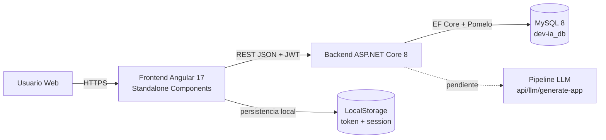
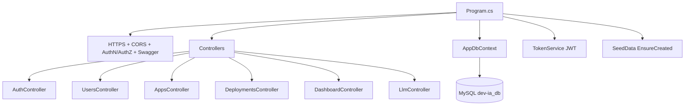
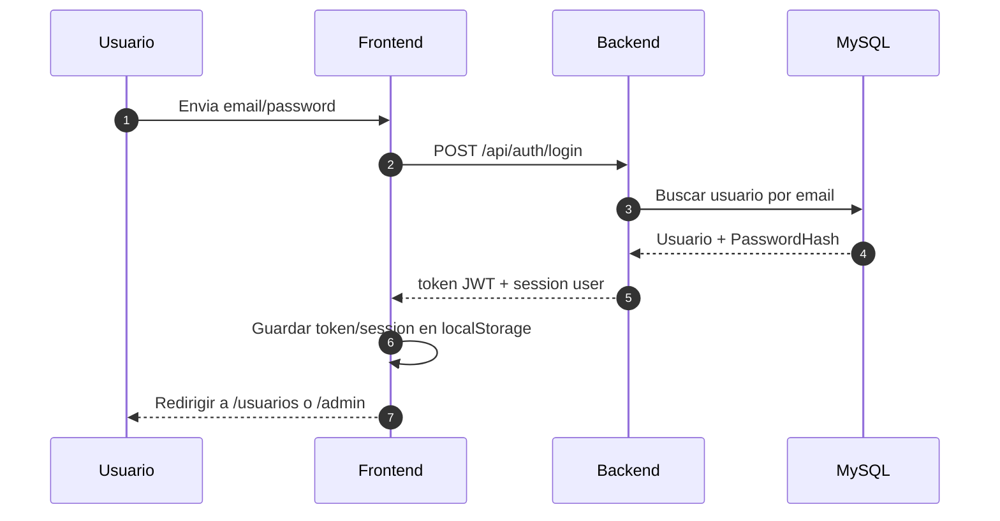
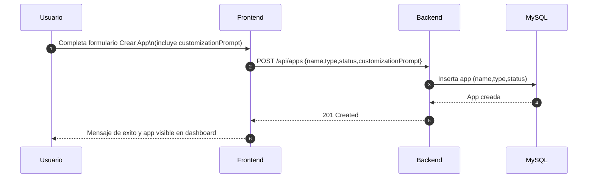
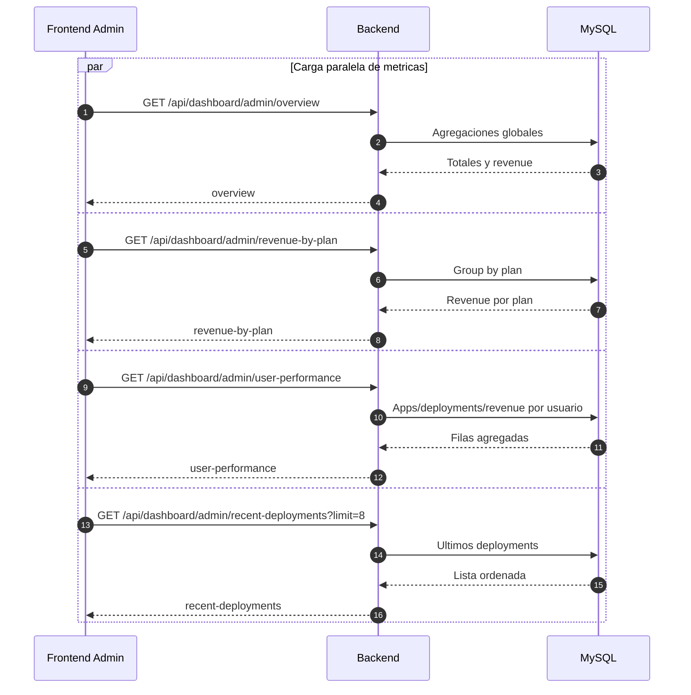

# DevIA Frontend - Arquitectura Actual

Este documento describe la arquitectura real implementada hoy entre:

- Frontend Angular (`/Volumes/SSD/Source/Repos/ARECH/Frontend/DevIA/devia`)
- Backend ASP.NET Core (`https://devia_be.arechsolutions.com/api`)
- Base de datos MySQL (`dev-ia_db`)

## 1. Vision general



## 2. Stack tecnico actual

- Frontend: Angular 17, Standalone Components, Signals, Reactive Forms, HttpClient, Router.
- Backend: ASP.NET Core 8, Controllers, JWT Bearer Auth, EF Core, Pomelo MySQL.
- Datos: MySQL 8 con 4 entidades principales (`Users`, `Apps`, `Deployments`, `Subscriptions`).
- Auth: JWT en `Authorization: Bearer <token>` agregado por interceptor.

## 3. Arquitectura del frontend

### 3.1 Modulos y flujo interno

```mermaid
flowchart TD
    APP[app.config.ts] --> ROUTER[app.routes.ts]
    APP --> HTTP[HttpClient + authInterceptor]
    APP --> APIURL[API_BASE_URL]

    ROUTER --> LOGIN[/login]
    ROUTER --> REG[/registro]
    ROUTER --> SHELL[AppShell + authGuard]

    SHELL --> USER[/usuarios]
    SHELL --> CREATE[/crear-app]
    SHELL --> ADMIN[/admin + adminGuard]

    LOGIN --> AUTHSVC[AuthService]
    REG --> AUTHSVC
    AUTHSVC --> APISVC[PlatformApiService]
    APISVC --> BACKEND[(Backend API)]
    AUTHSVC --> STORAGE[(localStorage)]

    USER --> APISVC
    CREATE --> APISVC
    ADMIN --> APISVC
```

### 3.2 Rutas y control de acceso

```mermaid
flowchart LR
    A[Usuario no autenticado] -->|/login o /registro| GUEST[guestGuard]
    GUEST -->|si ya tiene sesion| REDIR[redirect a /usuarios o /admin]
    GUEST -->|sin sesion| AUTHPAGES[Login / Registro]

    B[Usuario autenticado] --> AUTH[authGuard]
    AUTH --> SHELL[AppShell]
    SHELL --> U[/usuarios]
    SHELL --> C[/crear-app]
    SHELL --> AD[/admin]
    AD --> ADMING[adminGuard]
    ADMING -->|si no es admin| U
```

### 3.3 Estructura de carpetas (frontend)

```text
src/app
├── config/
│   └── api.config.ts
├── guards/
│   ├── auth.guard.ts
│   ├── guest.guard.ts
│   └── admin.guard.ts
├── interceptors/
│   └── auth.interceptor.ts
├── layouts/
│   └── app-shell/
├── models/
│   └── dashboard.models.ts
├── pages/
│   ├── login/
│   ├── register/
│   ├── user-dashboard/
│   ├── create-app/
│   └── admin-dashboard/
├── services/
│   ├── auth.service.ts
│   ├── auth-storage.constants.ts
│   └── platform-api.service.ts
├── app.routes.ts
└── app.config.ts
```

## 4. Arquitectura del backend (integracion actual)

### 4.1 Componentes backend



### 4.2 Modelo de datos (ER)

```mermaid
erDiagram
    USER_ACCOUNT ||--o{ GENERATED_APP : owns
    USER_ACCOUNT ||--o{ DEPLOYMENT_RECORD : triggers
    USER_ACCOUNT ||--o{ SUBSCRIPTION_RECORD : pays
    GENERATED_APP ||--o{ DEPLOYMENT_RECORD : has

    USER_ACCOUNT {
        guid Id PK
        string Name
        string Email UNIQUE
        string PasswordHash
        string AuthRole
        string ProfileRole
        string Location
        string Plan
        string Status
        datetime JoinedAtUtc
        string AvatarInitial
    }

    GENERATED_APP {
        guid Id PK
        guid UserId FK
        string Name
        string Type
        string Status
        datetime CreatedAtUtc
        datetime LastUpdateUtc
    }

    DEPLOYMENT_RECORD {
        guid Id PK
        guid UserId FK
        guid AppId FK
        string Environment
        string Status
        datetime TimestampUtc
        int DurationSeconds
    }

    SUBSCRIPTION_RECORD {
        guid Id PK
        guid UserId FK
        string Plan
        decimal PriceMonthly
        datetime StartedAtUtc
        string Status
    }
```

## 5. Flujos clave (secuencia)

### 5.1 Login



### 5.2 Crear app (estado actual)



Nota: `customizationPrompt` hoy se envia desde frontend pero backend aun no lo persiste ni lo usa.

### 5.3 Dashboard admin



## 6. API contract usado por el frontend

### 6.1 Auth

- `POST /api/auth/login`
- `POST /api/auth/register`
- `GET /api/auth/me`

### 6.2 Usuario y dashboard

- `GET /api/users` (admin)
- `GET /api/dashboard/me`
- `GET /api/dashboard/users/{userId}`
- `GET /api/users/{userId}/subscriptions`

### 6.3 Admin

- `GET /api/dashboard/admin/overview`
- `GET /api/dashboard/admin/revenue-by-plan`
- `GET /api/dashboard/admin/user-performance`
- `GET /api/dashboard/admin/recent-deployments?limit=8`

### 6.4 Apps

- `POST /api/apps`

## 7. Configuracion y ambientes

### 7.1 Frontend

- API base URL actual: `https://devia_be.arechsolutions.com/api`
- Almacenamiento local:
  - `devia-auth-token`
  - `devia-auth-session`

### 7.2 Backend

- CORS habilitado para:
  - `http://localhost:4200`
  - `https://devia.arechsolutions.com`
- Swagger habilitado en backend.
- JWT con expiracion configurada (12h en `appsettings.json`).

## 8. Pendientes arquitectonicos

- Pipeline LLM:
  - Endpoint existente `POST /api/llm/generate-app` retorna `501 Not Implemented`.
- Persistencia de prompt de personalizacion:
  - Frontend ya captura `customizationPrompt`.
  - Backend aun no tiene campo/contrato para guardarlo.
- Seguridad operativa:
  - Mover secretos y connection string a variables de entorno/secret manager en produccion.

## 9. Comandos utiles (frontend)

```bash
npm install
npm run start
npm run build
npm run test
```
